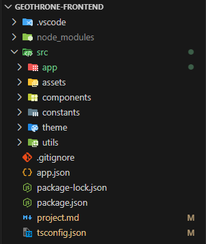
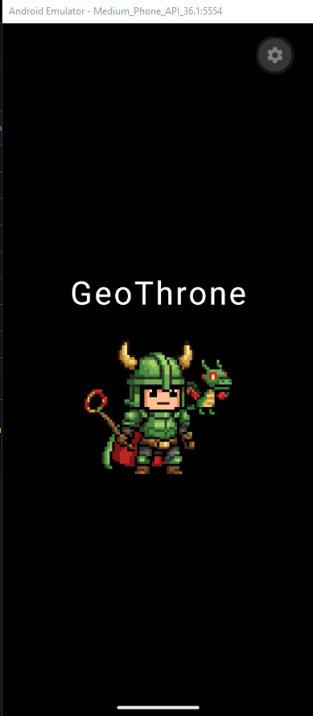
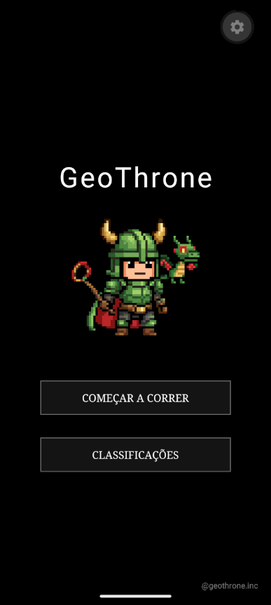
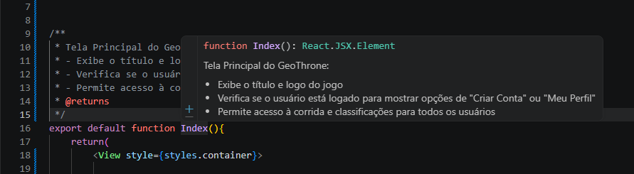

#1 -> Criado projeto ReactNative com Expo para o frontend com template typescript

#2 -> Design pattern do projeto   

 
#3 -> Organização e importação de todas as imagens do projeto
 

 

#4 -> Criação de alguns componentes reutilizaveis e criação da index page

 
#5 -> Introdução a documentação de funções com JSDoc
 